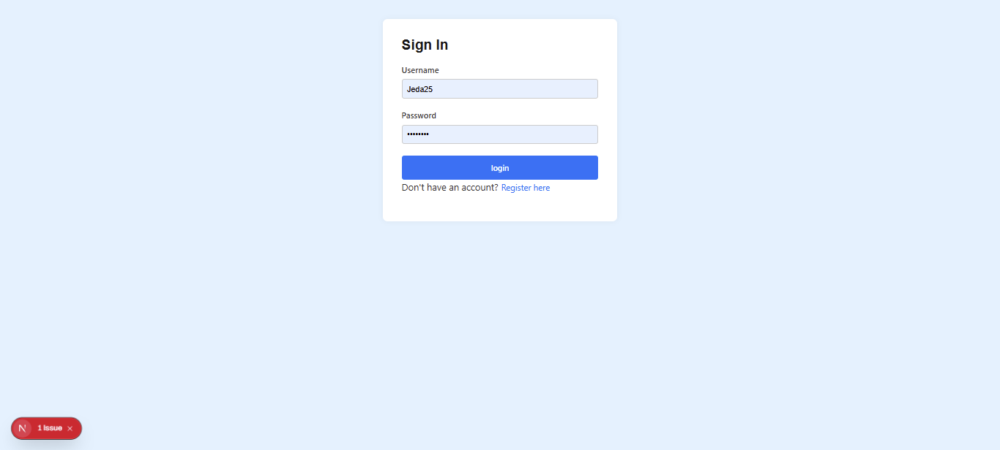
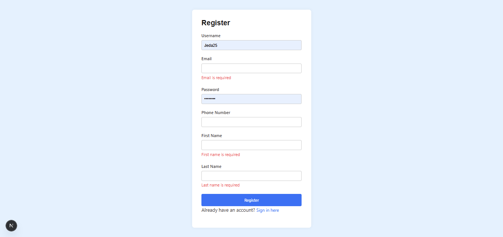
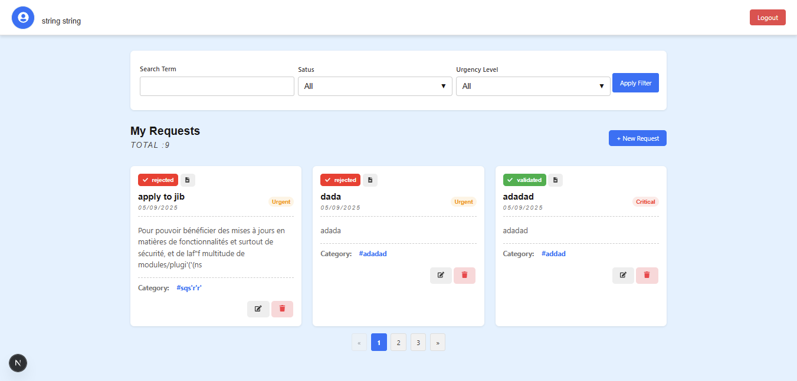
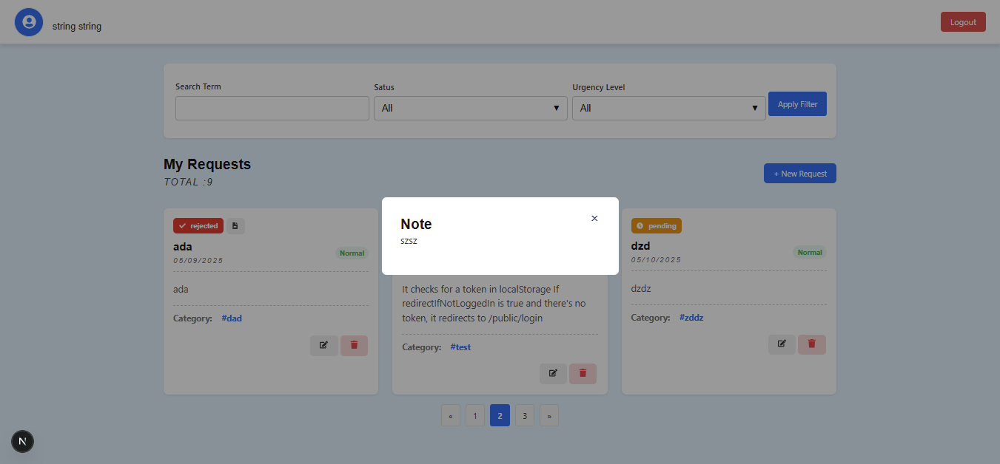
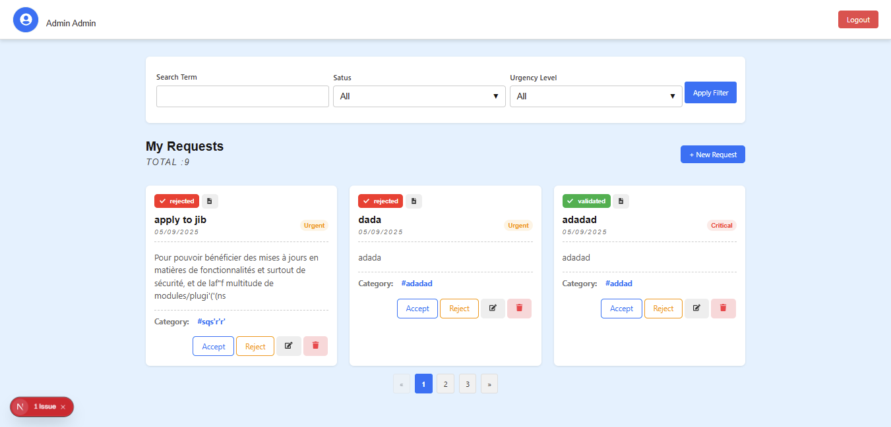
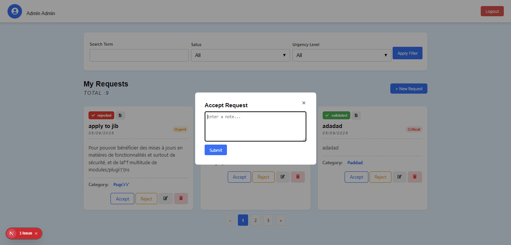

# Enterprise Help Desk Solution

**Enterprise Help Desk Solution** is a full-featured, scalable support system built with **Next.js**. It includes **authentication**, **real-time notifications**, **modular SCSS styling**, and a clean, maintainable architecture. 

Designed for enterprise-grade help desk workflows, the app supports **public and protected routes**, real-time communication using **WebSockets**, and API integration via **Axios**.

---

## 🚀 Features

- 🔒 Public & protected routing (`/public/login`, `/public/register`, `/protected/requests`)
- 📡 Real-time notifications via WebSocket (`socket.io-client`)
- 🎨 Theming support with SCSS variables
- 🧩 Modular architecture with reusable components and services
- 🔌 Axios instance with interceptors for API handling
- 🛎 Toast notifications with `react-toastify`

---

## 📁 Project Structure

```
src/
├── config/              # Configuration files
│   └── api.js           # Axios configuration (baseURL, interceptors, etc.)
├── hooks/               # Custom React hooks
│   ├── useAuth.js       # Auth context and hooks
│   ├── useIsAdmin.js    # Role-based access control
│   └── useSocket.js     # WebSocket setup
├── models/              # Data models and DTOs
├── pages/
│   ├── public/
│   │   ├── login.js     # Login screen (public)
│   │   └── register.js  # Registration screen (public)
│   └── protected/
│       └── requests.js  # Authenticated help desk requests page
├── services/            # API service handlers
├── styles/              # SCSS modules
│   └── _variables.scss  # Global theme variables
├── ui/                  # Reusable UI components
└── ...
```

---

## 🧪 Tech Stack

- **Next.js** – App framework
- **Sass + CSS Modules** – Scoped and themeable styles
- **Axios** – HTTP requests with interceptors
- **Socket.IO Client** – WebSocket-based live updates
- **React Icons** – SVG icons
- **React Toastify** – Toast alerts

---

## 🔐 Routing Overview

| Route                  | Type      | Description               |
|------------------------|-----------|---------------------------|
| `/public/login`        | Public    | Login page                |
| `/public/register`     | Public    | User registration page    |
| `/protected/requests`  | Protected | Authenticated request UI  |

Protected routes require valid authentication and are gated using a wrapper in `_app.js` or a higher-order component.

---


---

## 📦 Key Packages

```json
{
  "react-icons": "^5.5.0",
  "react-toastify": "^11.0.5",
  "socket.io-client": "^4.8.1" , 
}
```

---

## 🛠 Getting Started

1. **Install dependencies**
   ```bash
   npm install
   ```

2. **Run development server**
   ```bash
   npm run dev
   ```

3. **Build for production**
   ```bash
   npm run build
   ```

4. **Start production server**
   ```bash
   npm start
   ```

---

## 📘 Notes

- Axios configuration (base URL, auth headers, interceptors) is centralized in `src/config/api.js`.
- Theming is handled via SCSS variables in `styles/_variables.scss`.
- WebSocket logic is encapsulated in `useSocket`.
- Access control logic (e.g., admin check) is in `useIsAdmin`.

---
## Application Screenshots

Below are some example screenshots of the app:

### 1. Login Page:


### 2. Register Page:


### 3. Request Page (User):


### 4. Adding a Request:


### 5. Rejection or Validation Note:


### 6. Requests Page (Admin):


### 7. Validate or Reject Action (Admin):


## 📄 License

MIT

---
